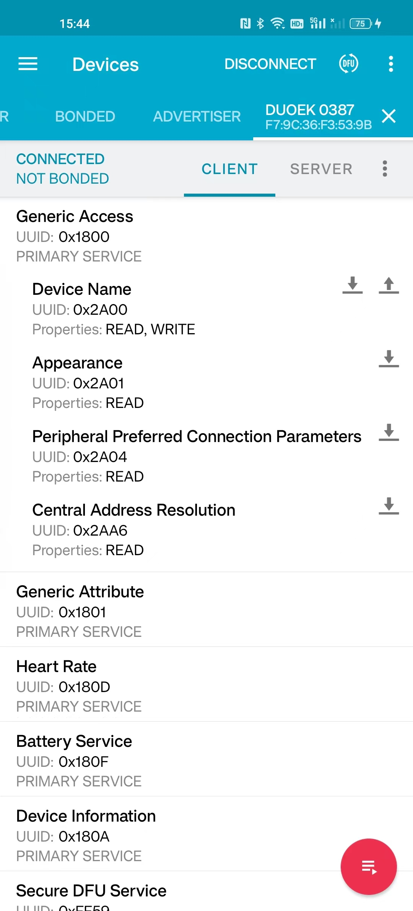

# BLE(Bluetooth Low Energy) Basics
Here we talk about how to connect Lepu/Viatom BLE devices and communicate with them.

At very beginning, we recomind a powerful app that you can use to debug almost everything about BLE: **nRF Connect for Mobile**
- [Android](https://play.google.com/store/apps/details?id=no.nordicsemi.android.mcp&hl=en&gl=US&pli=1)
- [iOS](https://apps.apple.com/us/app/nrf-connect-for-mobile/id1054362403)

Also they have provided libaries for varies platform at [
Nordic Semiconductor Github](https://github.com/NordicSemiconductor).

We have imported [Android-BLE-Library](https://github.com/NordicSemiconductor/Android-BLE-Library) into our own App, good compatibility and stability.

## How our BLE devices work
In fact, we don't need know all BLE terms and concepts, because the communication is simple. The devices work in the peripheral role(slave device) and make the advertisement, waiting the App(in the central role or master device) scan, connect and send command.
### 1. BLE Scan
For Android Apps, we have some concerns:
- the application requires `BLUETOOTH`, `BLUETOOTH_ADMIN`, `BLUETOOTH_SCAN`, `BLUETOOTH_CONNECT` permissions.
- targeting android 11 or lower, `ACCESS_FINE_LOCATION` is [REQUIRED](https://developer.android.com/guide/topics/connectivity/bluetooth/permissions#declare-android11-or-lower).
- ingore non BLE devices, `setScanMode(ScanSettings.SCAN_MODE_LOW_LATENCY)`.
- there is an error that looks like this `App 'com.example' is scanning too frequently`, that means you can't start BLE scan more than 5 times per minute.
- backgroud execution limits please refer to https://developer.android.com/about/versions/oreo/background.

Android apps are able to get BLE MAC address, but iOS apps can't.

[BLE Basics for Android Developers](https://punchthrough.com/android-ble-guide/)

### 2. BLE Connect
Here is some concers when connecting to BLE devices:
- MTU: most BLE devices use 23 as the default MTU, and some of them support 247 at max(Remember that GATT needs 3 bytes extra. This will allow packet size of 20 or 244 bytes. On some platform you simply can't change it, like Weixin mini-app or flutter.). This means that without changing the MTU, you can't send or receive more than 20 bytes in one packet, and you should split the data before writing to the characteristic.
- PreferredPhy: only supported on Android 8.0 or above.
- ConnectionPriority: you can request `CONNECTION_PRIORITY_HIGH`, this will provide a higher data transfer speed.

### 3. Services & Characteristics
After connecting to the app, we will check the Services and Characteristic.

What we concern:
3.1 There are a serial of Service UUIDs, some of them are standard or defined by Bluetooth SIG, Inc. For example: 0x180D refers to Heart Rate service, so we can read the value to get heart rate. Full specifications please check at [Assigned Numbers Document](https://www.bluetooth.com/specifications/assigned-numbers/).

3.2 One Service usually contains serval Characteristics. And Characteristic has Properties:
- **READ**: The client (app) reads the value of a characteristic or descriptor on the server (BLE device) and interprets it based upon a protocol that has been established beforehand. A smart thermostat may have a characteristic whose value represents the current target temperature.
- **WRITE**: The client (app) writes some bytes to a characteristic or descriptor on the server (BLE device).The server’s firmware processes the write and performs some server-side operation in response to it. For example, a smart thermostat may have a characteristic that changes the target temperature when written to.
- **Notify/Indicate**: The client (app) subscribes to a characteristic for notifications or indications, and is notified by the server when the value of the characteristic changes. A smart thermostat may have a notifiable characteristic that will report changes in ambient temperature when it’s subscribed to.

3.3 For security and confidentiality purposes, our Lepu/Viatom devices use particular Service & Characteristic UUIDs, for example, ER1/ER2 devices use:
- service_uuid = "14839ac4-7d7e-415c-9a42-167340cf2339"
- write_uuid = "8B00ACE7-EB0B-49B0-BBE9-9AEE0A26E1A3"
- notify_uuid = "0734594A-A8E7-4B1A-A6B1-CD5243059A57"

Here I will show how to get device information via BLE:
1. connect the device via App
2. optional: ConfigureMTU() - mtu=247
3. optional: PHY updated (TX: LE 2M, RX: LE 2M)
4. setCharacteristicNotification() - notify_uuid: "0734594A-A8E7-4B1A-A6B1-CD5243059A57"
5. send get info command to write_uuid: "8B00ACE7-EB0B-49B0-BBE9-9AEE0A26E1A3", value: (0x) A5-E1-1E-00-01-00-00-02. (refer to [Er1BleCmd.java](https://github.com/viatom-develop/LepuBle/blob/master/app/src/main/java/com/lepu/lepuble/ble/cmd/Er1BleCmd.java))
6. receive notification from notify_uuid: "0734594A-A8E7-4B1A-A6B1-CD5243059A57":
   1. value: (0x) A5-E1-1E-01-01-3C-00-41-04-08-01-01-00-02-00-00-34-30-31-30
   2. value: (0x) 30-30-30-32-01-00-00-31-36-01-00-E6-07-0B-16-10-25-3A-F8-03
   3. value: (0x) 00-00-00-00-0A-32-31-30-38-34-45-30-33-38-37-00-00-00-00-00
   4. value: (0x) 00-00-00-00-00-00-00-23
7. remove the bluetooth protocol bytes, you can get device info struct bytes (0x)  41-04-08-01-01-00-02-00-00-34-30-31-30-30-30-30-32-01-00-00-31-36-01-00-E6-07-0B-16-10-25-3A-F8-03-00-00-00-00-0A-32-31-30-38-34-45-30-33-38-37-00-00-00-00-00-00-00-00-00-00-00-00, this is [ER1 devcice info struct](https://github.com/viatom-develop/LepuBle/blob/master/app/src/main/java/com/lepu/lepuble/ble/Er1BleInterface.kt#L260).

### 4. DFU
// todo